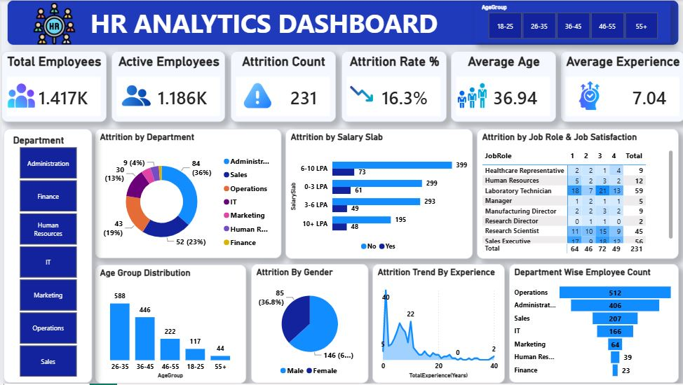

# HR Analytics

This folder contains an HR analytics dataset and a Power BI dashboard for exploring employee attrition, workforce demographics, compensation, satisfaction, and tenure.

## Contents

- `HR_Analytics-4.csv` - Source dataset with 1,480 employee records and 37 fields.
- `HR_analytics_dashboard.pbix` - Power BI dashboard built from the HR dataset.

## Dataset Overview

The data describes employee characteristics, work conditions, compensation, performance, and employment history. The `Attrition` field indicates whether an employee left the organization (`Yes` or `No`).

Important analysis areas include:

- **Attrition:** attrition status, overtime, business travel, and distance from home
- **Workforce profile:** age group, gender, department, job role, education, and marital status
- **Compensation:** monthly income, salary slab, daily rate, hourly rate, salary hike, and stock option level
- **Employee experience:** job level, total experience, years at company, years in current role, years since promotion, and years with current manager
- **Engagement:** environment, job, relationship, and work-life balance satisfaction
- **Performance and development:** job involvement, performance rating, training, and number of companies worked

## Using the Dashboard

1. Open `HR_analytics_dashboard.pbix` in Power BI Desktop.
2. If prompted, update the source path to `HR_Analytics-4.csv` in this folder.
3. Refresh the dataset after changing the CSV or its location.
4. Use the dashboard filters to compare attrition across departments, roles, demographics, compensation bands, and employee experience.

## Data Notes

- `EmpID` is an employee identifier; `EmployeeNumber` is a numeric employee key.
- `EmployeeCount` and `StandardWorkingHours` are constant fields in the supplied data.
- Satisfaction, involvement, performance, and education fields are coded numeric ratings. Refer to the dashboard model or field names when interpreting their scales.
- The CSV should be treated as the source of record for refreshes. Keep its column names and order stable unless the Power BI model is updated as well.

## Screenshots

